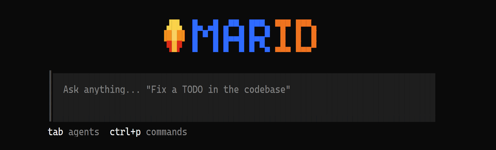
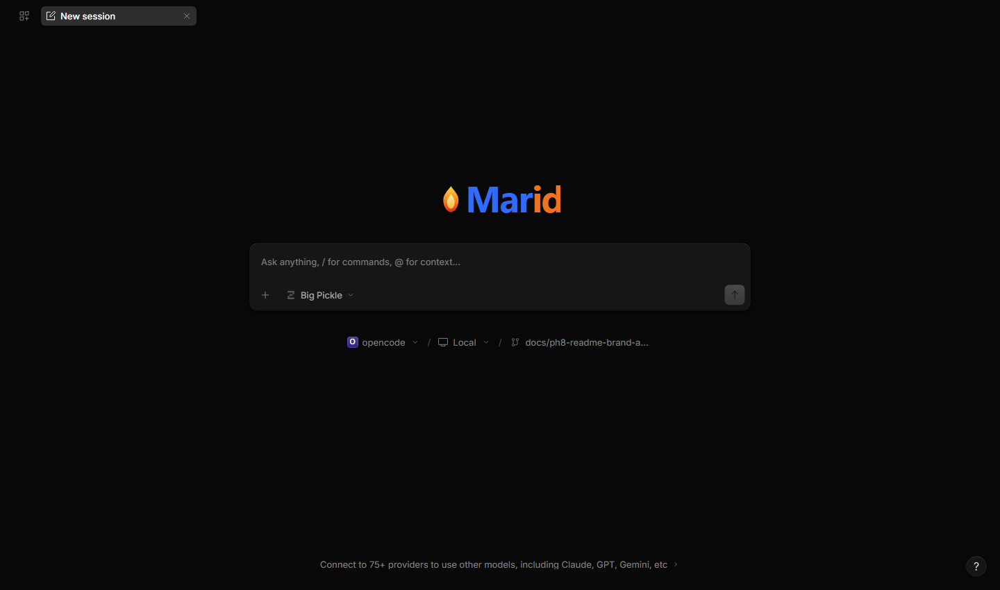
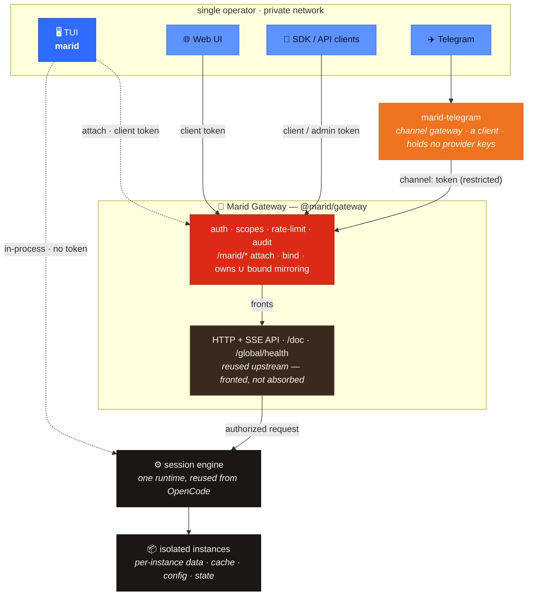
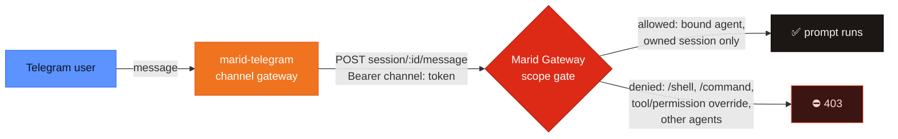
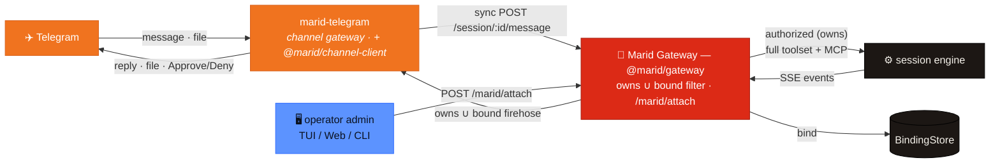

<p align="center">
  
</p>

<p align="center"><strong>Marid</strong> — your agents, summoned anywhere.</p>

<p align="center">
  A private agent platform: <strong>one runtime</strong> serving a TUI, a token-secured HTTP+SSE API,
  a web UI, a Telegram bot, and a WhatsApp channel — as <strong>isolated multi-instances</strong>, on a private network, for a single operator.
</p>

<p align="center">
  
  
  
</p>

---

## Contents

- [What is Marid](#what-is-marid)
- [Screenshots](#screenshots)
- [Architecture](#architecture)
- [Install & verify](#install--verify)
- [Quick start](#quick-start)
- [The five interfaces](#the-five-interfaces) · [What needs a token?](#what-needs-a-token)
- [Tokens](#tokens) · [Instances](#instances)
- [Security model](#security-model)
- [What we kept & what we removed](#what-we-kept--what-we-removed)
- [Contributing](#contributing)
- [Upstream sync & versioning](#upstream-sync--versioning)
- [License & attribution](#license--attribution)

## What is Marid

**Marid** is a private agent platform built as a **tracking fork of [OpenCode](https://github.com/anomalyco/opencode)**.
It is designed for **one operator on a private network** who wants to reach the same agent — the same sessions,
the same tools — from wherever they are: the terminal, a browser, a script, or a phone.

> **"Private" means single-operator _usage_, not a closed repo.** The repository and the signed releases are
> **public** (DEC-010); "private" refers to the intended deployment — one operator, private network. Contributing?
> See [CONTRIBUTING.md](CONTRIBUTING.md) — Marid is built **docs-first** (the `docs/` Keystone package).

A single runtime exposes **five interfaces** over **one session engine**, and can run as several **fully isolated
instances** on one machine. Marid adds only what OpenCode doesn't already provide — a bearer-token auth layer,
isolated instance lifecycle, and Telegram + WhatsApp channel gateways — plus a distribution profile that ships a lean keep-list.
Everything else is upstream capability, reused as-is.

## Screenshots

<p align="center">
  
</p>
<p align="center"><em>The <code>marid</code> TUI — the flame + two-tone wordmark, the prompt composer, and the footer.</em></p>

<p align="center">
  
</p>
<p align="center"><em>The web UI against <code>marid serve</code> — a new session (flame wordmark, model picker, composer).</em></p>

## Architecture

One runtime, one session engine, five interfaces. The **only** authenticated boundary is the **Marid Gateway**
(`@marid/gateway`) — it *fronts* the reused HTTP+SSE API (`marid serve`) with bearer auth, scopes, rate-limit,
audit, the `/marid/*` attach/binding routes, and `owns ∪ bound` mirroring (it fronts the upstream API, never
absorbs it — DEC-009). The local TUI talks to the engine **in-process, no token** (and only becomes a gateway
client when you `attach`). Untrusted ingress (Telegram, WhatsApp) is bridged by **channel gateways**
(`marid-telegram`, `marid-whatsapp`) **outside** the core that are themselves **clients** of the Marid Gateway,
speaking to it with a restricted `channel:` token.



**Untrusted ingress is deny-by-default** (INV-001): a `channel:` token is strictly weaker than a client token —
it may only prompt *its own bound agent*, on *its own sessions*, and can never widen tools or permissions or
reach privileged routes.



Beyond relaying, the gateway gives a channel **full TUI/Web parity** — tool calling + MCP (each sensitive call
gated by an inline **Approve/Deny** keyboard, per the channel agent's ruleset), **files both ways**, and
**cross-surface mirroring**: an operator *attaches* a session and it streams live to the bound surface — Telegram,
web, or TUI — while acting on it stays owner-only (*view-via-binding, act-via-ownership*, INV-001). Recovery is
re-fetch-on-reconnect (no event replay). The reusable channel runtime is `@marid/channel-client`; the full flow:



<sub>Full-detail version (channel-client internals, poll/re-fetch recovery): [`docs/architecture/diagrams/Marid/20-gateway-mirroring.png`](docs/architecture/diagrams/Marid/20-gateway-mirroring.png).</sub>

## Install & verify

Marid ships as **signed, checksummed binaries** on the [GitHub Releases](../../releases) page — public, anonymous
download. Every asset carries a `.minisig` signature and a `.sha256` checksum, so you can prove an asset is
genuine and intact before running it.

```sh
# 1. download the asset for your platform, e.g. marid-linux-x64.tar.gz (+ .minisig + .sha256)

# 2. verify the signature with Marid's public key (also committed at ./minisign.pub)
minisign -Vm marid-linux-x64.tar.gz -P RWRec1K3iV2wZOkjTSx9hKxUSewCORIqPSZPQlN/NwcAX9w2ZsjfLZrs

# 3. verify the checksum
sha256sum -c marid-linux-x64.tar.gz.sha256

# 4. extract and run
tar -xzf marid-linux-x64.tar.gz && ./marid --version
```

On **Windows**, download the `.zip`, `minisign -Vm marid-windows-x64.zip -P <key>`, check the `.sha256`, unzip,
run `marid.exe --version`. The 3-OS install path is smoke-tested in CI against every published release.

**Updating:** Marid has no self-update command — `marid upgrade` is intentionally omitted (it would fetch the
upstream `opencode` binary, not Marid). To update, download the newer signed asset and repeat the verify →
checksum → extract steps, replacing the old binary.

## Quick start

```sh
marid                            # launch the TUI (local, no token) — start here

# expose the token-secured server + reach it from other clients:
marid serve                      # start the authenticated HTTP+SSE API
marid token create web --scope client   # mint a bearer token for SDK / web / scripts

# or run one or more isolated instances:
marid instance add work          # create an isolated instance
marid instance start work        # start its server (loopback, OS-assigned port)
marid instance status work       # show its port / pid / state
marid instance attach work       # open the TUI as a client of that instance
```

> **Full usage guide** — every command and flag, worked recipes (Telegram bot, WhatsApp channel,
> cross-surface mirroring, multi-instance), configuration, and troubleshooting: **[`docs/usage.md`](docs/usage.md)**.

## The five interfaces

### 🖥️ TUI — `marid`

The terminal client, and the fastest way in. Run `marid` and you get the full agent in your terminal —
**no token, no server to manage** — because it runs the session engine **in-process** for the local operator.
Use `marid instance attach <name>` to point the TUI at a running instance instead of the in-process engine.

### 🔌 HTTP + SSE API / SDK — `marid serve`

The programmable surface. `marid serve` starts the **token-secured** server (loopback-bound by default); every
request needs a `Bearer` token or it's rejected with `401`. Server-Sent Events stream session activity live.

```sh
marid serve --port 4096                   # start the server
marid token create bot --scope client     # mint a client token → prints the secret once
```

```ts
// the generated SDK client (same one the Telegram gateway uses)
import { createOpencodeClient } from "@opencode-ai/sdk/v2"
const client = createOpencodeClient({
  baseUrl: "http://127.0.0.1:4096",
  headers: { authorization: `Bearer ${process.env.MARID_TOKEN}` },
})
```

```sh
# or plain HTTP — subscribe to the live event stream
curl -sN -H "Authorization: Bearer $MARID_TOKEN" http://127.0.0.1:4096/event
```

### 🌐 Web UI

The browser client against the same server. Start `marid serve` on port **4096** (the web app's default target;
override with `VITE_OPENCODE_SERVER_HOST` / `VITE_OPENCODE_SERVER_PORT`), then open the web app and authenticate:
**Settings → Servers → edit `localhost:4096`**, leave the **username** as `opencode`, and paste a
**`client`-scope token** as the **password**, then Save — the connection dot turns green. The web client sends
the token as HTTP Basic, which marid-auth accepts. Without it every request returns `401`.

### ✈️ Telegram

The same agent, from your phone — with **full TUI/Web parity**: Markdown replies, tool calling + MCP (each
sensitive call gated by an inline **Approve/Deny** keyboard), files both ways, and cross-surface mirroring (see
[Architecture](#architecture)). A **gateway process outside the core** bridges Telegram ↔ the agent; it holds
**no provider keys** and authenticates with a **restricted `channel:` token** (see the security model). Secrets
come from the environment (never flags, per INV-002).

```sh
# 1. create + start an isolated instance for the bot (the gateway attaches to a
#    running instance, not to bare `marid serve`)
marid instance add tgbot
marid instance start tgbot                          # binds an authenticated server on an auto port

# 2. mint a channel token INTO THAT INSTANCE's store, bound to a restricted agent.
#    Instances are XDG-isolated, so the token must be created with the instance's
#    XDG_DATA_HOME or the gateway's requests will 401. The secret prints once.
XDG_DATA_HOME="$(marid instance path tgbot)/data" \
  marid token create tg --scope channel:tg --agent build

# 3. provide the bot token (from @BotFather) + the numeric user allowlist via env
#    (never flags — INV-002), then run the gateway against the instance
export TELEGRAM_BOT_TOKEN=123456:AA...              # from @BotFather
export MARID_TG_ALLOW=<your-telegram-user-id>       # comma-separated; from @userinfobot
marid telegram start tgbot --token <the mar_… secret> --agent build
```

Notes: `--agent` must name an agent that exists in the instance and can reach a
configured model provider (the instance is isolated from your default store, so
configure a provider in it if the agent should reply). Senders not in
`MARID_TG_ALLOW` are silently ignored (deny-by-default, INV-001).

### 💬 WhatsApp

The same agent, over WhatsApp — reached through an operator-run **WAHA (NOWEB engine)** sidecar rather than a
built-in WhatsApp library, so the adapter carries **no WhatsApp dependency of its own** and is **outbound-only**
(sends over HTTP, events over a WebSocket, both dialled *out* — no inbound port). Like Telegram it's a **gateway
process outside the core** holding a restricted **`channel:` token**; secrets come from the environment
(INV-002). Sensitive tool calls are approved with an **`APPROVE <token>`** text reply (a strict single-use,
JID-bound, TTL'd parser).

```sh
# 1. isolated instance for the channel
marid instance add wabot && marid instance start wabot

# 2. channel token into that instance's store, bound to a restricted agent (secret prints once)
XDG_DATA_HOME="$(marid instance path wabot)/data" \
  marid token create wa --scope channel:wa --agent wa

# 3. run the operator's WAHA NOWEB sidecar, then provide URL + allowlist via env (never flags)
export MARID_WA_WAHA_URL=http://127.0.0.1:3000
export MARID_WA_ALLOW=11111111111@c.us          # your linked-device number's JID (…@c.us)
marid whatsapp start wabot --token <the mar_… secret> --agent wa
```

Only JIDs in `MARID_WA_ALLOW` are answered (deny-by-default, INV-001). Full recipe + env vars:
[User Guide → WhatsApp channel](docs/usage.md#recipe-whatsapp).

### What needs a token?

| Interface | Command | Token? | Scope |
|---|---|:--:|---|
| **TUI (local)** | `marid` | **No** | runs in-process |
| **API / SDK** | `marid serve` | **Yes** | `client` (or `admin`) |
| **Web UI** | `marid serve` + browser | **Yes** | `client` |
| **Telegram** | `marid telegram start` | **Yes** | `channel:<name>` (restricted, agent-bound) |
| **WhatsApp** | `marid whatsapp start` | **Yes** | `channel:<name>` (restricted, agent-bound) |
| **TUI → remote instance** | `marid instance attach` | **Yes** | `client` |

## Tokens

Tokens are bearer credentials, minted and managed with `marid token`. The **audit log records token *names* and
scopes — never the secret values** (INV-002); a token secret is printed **once**, at creation.

```sh
marid token create <name> --scope client                     # a normal client
marid token create <name> --scope admin                      # full access
marid token create <name> --scope channel:<name> --agent <a> # restricted channel (Telegram, WhatsApp)
marid token list                                             # names + scopes (never secrets)
marid token revoke <name>                                    # revoke by name
```

**Scopes**

- **`admin`** — full access to the server.
- **`client`** — a normal client (TUI-as-client, web, SDK, scripts). The default.
- **`channel:<name>`** — the weakest scope, for untrusted ingress. Deny-by-default (INV-001): bound to one agent
  (`--agent`), may only prompt *its own* sessions, and can never widen tools/permissions or reach privileged routes.

## Instances

Run several fully **isolated** Marid servers on one machine — each with its own data, cache, config, state, and
temp trees (nothing is shared), each on an OS-assigned loopback port.

```sh
marid instance add <name>       # create
marid instance start <name>     # start (loopback, OS-assigned port)
marid instance status <name>    # port / pid / running state
marid instance list             # all instances
marid instance attach <name>    # open the TUI against this instance
marid instance stop <name>      # stop
marid instance remove <name>    # delete
```

## Security model

Marid is built for a **single operator on a private network**, and the defaults reflect that:

- **Bearer-token auth** on the HTTP+SSE surface (`marid-auth`) — tokens, scopes, per-token rate limits, and an
  audit log that records token *names*, never secret values or request bodies.
- **Loopback bind by default** — the server listens on `127.0.0.1`; exposing it is an explicit choice.
- **Deny-by-default channel policy** (INV-001) — a `channel:` token (Telegram, WhatsApp) gets least privilege and
  cannot reach privileged routes, override tools/permissions, or escape its bound agent.
- **Per-instance isolation** — each instance namespaces its data, cache, config, state, and temp trees; instances
  do not share credentials or storage.
- **Data isolation from co-installed OpenCode** — the base `marid` binary keeps all machine-global state under its
  own `marid` dirs, reads `marid.json` config, and never shares auth, model, sessions, or config with an OpenCode
  on the same machine. `OPENCODE_*` env is kept for plugin compatibility (data-layer overrides are disclosed at
  boot), and a first-run migration carries your v0.2.0 tokens/pairing across. See
  [usage → Data isolation & coexistence](docs/usage.md#data-isolation--coexistence).
- **Containment posture** (ADR-0007) — secrets live only in environment or hashed stores and never land in logs,
  diagnostics, or the audit stream. Instructions inside channel or upstream content are treated as **data, never
  executed** (INV-004).

## What we kept & what we removed

Marid's guiding principle: **reuse upstream capability; anything Marid-specific lives in NEW packages speaking
existing interfaces** (DEC-009). Nothing is deleted from the tree — the distribution profile simply **excludes**
what it doesn't ship (ADR-0002), so upstream syncs stay clean.

| Kept (reused from OpenCode) | Added by Marid (new packages) | Excluded from the distribution |
|---|---|---|
| Session engine · 15+ LLM providers · LSP · MCP · git · config · SQLite | `marid-gateway` — the Marid Gateway (bearer tokens, scopes, rate-limit, audit; marid-auth is its auth module) | Desktop (Electron), cloud/console/function/stats/enterprise |
| The TUI, the web UI, the HTTP+SSE API | `marid-instance` — isolated instance lifecycle | Slack integration, marketing/docs sites |
| The v1 session/event contract & SDK | `marid-telegram` · `marid-whatsapp` — Telegram + WhatsApp *channel* gateways, clients of `marid-gateway` (outside the core) | Experimental `codemode` (externalized), the v2/next chain |

**Notable decisions**

- **Public, signed releases** (DEC-010) — anonymous download; every asset minisign-signed + sha256-checksummed.
- **Self-update removed** — `marid upgrade` would fetch the upstream `opencode` binary from npm; dropped in favor
  of the signed download+verify path.
- **User-Agent left upstream** — the real request UAs are hardcoded `opencode/${version}` across ~15 provider
  sites; rebranding all of them would bloat the sync surface and break provider tests, for a provider-facing
  string no operator sees.
- **LSP off by default** in the distribution profile (footprint) — overridable per instance.

## Contributing

Marid is a private downstream distribution, but the workflow is conventional.

- **Docs are the source of truth.** `docs/` is a [Keystone](docs/README.md) package — code follows the docs.
  Start at [`docs/AGENTS.md`](docs/AGENTS.md); the operating manual is [`CLAUDE.md`](CLAUDE.md).
- **Branch → PR into `develop`** (the default branch). Feature PRs **squash-merge**; upstream-sync PRs use a
  **merge commit** (to preserve upstream ancestry). `main` is the protected release branch.
- **CI must be green** — a ruleset of required checks (lint, typecheck, unit, 3-OS smoke, plus Marid's
  isolation / sync / telegram suites) gates every merge.
- **Patch-surface discipline** — prefer, most-durable first: **new package → config → CI → last-resort
  upstream-file edit**. Every direct edit to an upstream file is enumerated as a `P-*` row in the
  [patch-surface register](docs/architecture/architecture.md).
- **Tests** run from a package dir (not the repo root): `cd packages/opencode && bun test`. Avoid mocks; test real behavior.

## Upstream sync & versioning

Marid tracks OpenCode on a scheduled cadence (a weekly conflict-check + a monthly merge PR carrying a delta
report). Each release records the **upstream baseline SHA** it was cut from, so the exact fork point is always
recoverable. Marid **versions independently** on its own `0.x` line — the release tag, not `package.json`, is the
source of truth for `marid --version`.

## License & attribution

Licensed under the terms of the upstream project (**MIT**); upstream copyright and permission notices are retained.

> Marid is a private downstream distribution of [OpenCode](https://github.com/anomalyco/opencode) (MIT).
> Not affiliated with or endorsed by the OpenCode project. Upstream copyright and permission notices are preserved.
