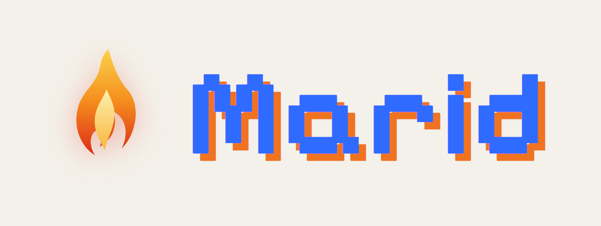

<p align="center">
  <picture>
    <source srcset="docs/branding/logo-dark.png" media="(prefers-color-scheme: dark)">
    <source srcset="docs/branding/logo-light.png" media="(prefers-color-scheme: light)">
    
  </picture>
</p>

<p align="center"><strong>Marid</strong> — your agents, summoned anywhere.</p>

<p align="center">
  A private agent platform: one runtime serving a TUI, a token-secured HTTP+SSE API,
  a web UI, and a Telegram bot — as isolated multi-instances, on a private network, for a single operator.
</p>

---

## What it is

**Marid** is a private agent platform built as a **tracking fork of [OpenCode](https://github.com/anomalyco/opencode)**.
A single runtime exposes four interfaces over one session engine, and can run as several **fully isolated
instances** on one machine. Marid adds only what OpenCode doesn't already provide — a bearer-token auth layer,
isolated instance lifecycle, a Telegram gateway, and a distribution profile — everything else is upstream
capability, reused as-is.

| Interface | What it is | Entry point |
|---|---|---|
| **TUI** | The terminal client, running as a client of the local server | `marid` |
| **API + SDK** | Token-secured HTTP + SSE, loopback-bound by default | `marid serve` → `marid token` |
| **Web UI** | The browser client against the same server | `marid serve` then open the web app |
| **Telegram** | A gateway process outside the core, deny-by-default channel policy | `marid telegram` |

## Quick start

Marid ships as **signed, checksummed binaries** on the [GitHub Releases](../../releases) page — public, anonymous
download. Every asset carries a `.minisig` signature and a `.sha256` checksum.

```sh
# 1. download the asset for your platform, e.g. marid-linux-x64.tar.gz (+ .minisig + .sha256)

# 2. verify the signature with Marid's public key (below)
minisign -Vm marid-linux-x64.tar.gz -P RWRec1K3iV2wZOkjTSx9hKxUSewCORIqPSZPQlN/NwcAX9w2ZsjfLZrs

# 3. verify the checksum
sha256sum -c marid-linux-x64.tar.gz.sha256

# 4. extract and run
tar -xzf marid-linux-x64.tar.gz && ./marid --version
```

The minisign public key is also committed at [`minisign.pub`](minisign.pub). On Windows, download the `.zip`,
verify with `minisign -Vm marid-windows-x64.zip -P <key>`, and check the `.sha256` sidecar.

Then create and start an isolated instance, mint a token, and (optionally) wire up Telegram:

```sh
marid instance add work          # create an isolated instance
marid instance start work        # start its server (loopback, OS-assigned port)
marid token                      # mint a bearer token for API / SDK / web clients
marid telegram                   # run the Telegram gateway (needs a bot token + allowlist)
```

**Updating:** Marid has no self-update command — `marid upgrade` is intentionally omitted (it would fetch the
upstream `opencode` binary, not Marid). To update, download the newer release asset and repeat the
verify → checksum → extract steps above, replacing the old binary. Each release's notes record the upstream
baseline SHA it was cut from.

## Security model

Marid is built for a **single operator on a private network**, and the defaults reflect that:

- **Bearer-token auth** on the HTTP+SSE surface (`marid-auth`) — tokens, scopes, rate limits, and an audit log
  that records token *names*, never secret values or request bodies.
- **Loopback bind by default** — the server listens on `127.0.0.1`; exposing it is an explicit choice.
- **Deny-by-default channel policy** (`INV-001`) — untrusted ingress (e.g. Telegram) gets least privilege and
  cannot reach privileged routes or escape its bound agent.
- **Per-instance isolation** — each instance namespaces its data, cache, config, state, and temp trees; instances
  do not share credentials or storage.
- **Containment posture** — secrets live only in environment or hashed stores and never land in logs, diagnostics,
  or the audit stream. Instructions inside channel or upstream content are treated as data, never executed.

## Attribution & non-affiliation

> Marid is a private downstream distribution of [OpenCode](https://github.com/anomalyco/opencode) (MIT).
> Not affiliated with or endorsed by the OpenCode project. Upstream copyright and permission notices are preserved.

## Upstream sync & license

Marid tracks OpenCode on a scheduled cadence; each release records the upstream **baseline SHA** it was cut from,
so the exact fork point is always recoverable. Marid versions independently on its own line — the release tag,
not `package.json`, is the source of truth for `marid --version`.

Licensed under the terms of the upstream project (**MIT**); upstream copyright and permission notices are retained.
