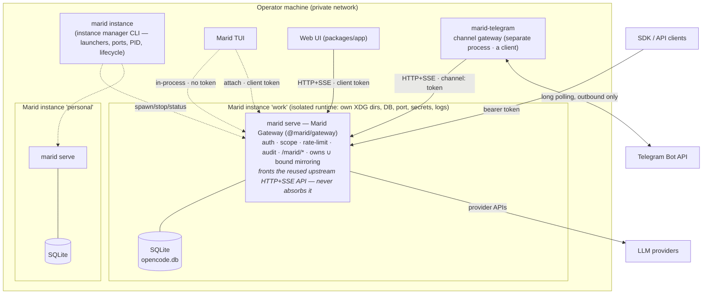

# Marid — Target Architecture (Gate 5)

Marid is a **tracking fork of OpenCode plus a small set of new downstream packages**. The design rule
(DEC-009, approved): reuse upstream capability; anything Marid-specific lives in NEW packages speaking
existing interfaces; direct edits to upstream files are a last resort and every one is enumerated in the
patch-surface register below.

## Principles

1. **One server process per instance.** Every client — TUI, web UI, SDK consumers, channel gateways —
   attaches to that instance's server over the same HTTP+SSE API. This makes cross-interface sync
   (FR-038..043) a property of the existing event bus instead of a new distributed system (C-5).
2. **Additive fork.** Downstream delta = new packages + distribution profile + config defaults.
   Target: ≤ 1 small upstream-file edit (the server extension seam, if no equivalent hook exists).
3. **Untrusted ingress stays outside the core.** Channel gateways are separate processes with their own
   credentials and a capability policy; compromise of a gateway is bounded by its API token (C-7, INV-001).
4. **v1 API now, v2 watched.** Marid builds on the stable v1 surface + published SDK; the v2/sdk-next
   migration is tracked at every upstream sync (C-4, RISK-001).

## Container view



## Components

| Component | Kind | Realizes | Basis / evidence |
|---|---|---|---|
| Runtime core (agent loop, tools, permissions, skills, plugins, MCP, providers, storage) | Upstream, unchanged | FR-001..021 | Gate-4 assessment: reuse as-is |
| Server + SSE (v1 surface) | Upstream, unchanged | FR-022..029, FR-034 partial | R-02: 7 FRs as-is |
| **marid-gateway** (new pkg; marid-auth is its auth module, ADR-0011) | Middleware via server extension seam | FR-031 bearer-token auth (per-client tokens with scopes), FR-032 rate limiting, FR-033 audit log, FR-030 request-ID correlation | Shaheen `Server.extend` pattern; single enumerated seam |
| **marid-instance** (new pkg, CLI) | Instance manager | FR-053 (IDs, launchers, port allocation, per-instance XDG/OPENCODE env, PID files, start/stop/status/logs, locks) | claudectl pattern (R-11) + R-05 conflict inventory |
| **marid-telegram** (new pkg, process) | Channel gateway (a client of `marid-gateway`) | FR-045..052: long-polling ingress, `update_id` dedup, operator allowlist, HTML formatting, edit-coalesced streaming (≥2 s cadence), permission prompts as inline keyboards, media within Bot-API caps | R-09; slack-prototype loop; Shaheen gateway pattern |
| Channel capability policy | Config (instance-level) + gateway enforcement | FR-052, INV-001: channel maps to a dedicated restricted agent (tool/permission ruleset), scoped API token, model+cost caps at the gateway | R-04 permission rulesets; C-7 |
| TUI / Web UI (packages/app) | Upstream, config-rebranded | FR-003, CON-005 | R-06: app rides the same API |
| Config layer | Upstream + Marid defaults | FR-054/055; instance layer supplied by marid-instance via env (`OPENCODE_CONFIG`, XDG overrides); secret redaction rules | R-05 precedence chain |
| Observability | Upstream OTLP (opt-in) + audit stream from marid-auth | FR-056/057/059; GenAI attrs pinned (R-10) | R-05: OTLP wired |
| Distribution profile | Build/release config | FR-060, CON-004/005: `marid` profile builds core+tui+app+new pkgs; excludes desktop/console/stats/slack/function/enterprise/containers/docs-site/etc. | C-2, C-6 |
| Upstream-sync workflow | Process + CI | FR-061: upstream remote, scheduled merge branch, conflict-detector CI, delta report, security fast-path | C-1, R-10 |

## Patch-surface register (every planned upstream-file edit)

| # | Edit | Why unavoidable | Size | Sync risk |
|---|---|---|---|---|
| ~~P-1~~ | **Not required for MVP** (resolved by EXP-004): marid-auth attaches as an outer wrapper around the exported `Server.Default.app.fetch` (self-contained `toWebHandler`, no `listen()` needed) — no upstream server edit. Revisit only if in-Effect-pipeline request-ID/trace correlation (deep FR-030) is later required. | n/a — wrapper composes the exported handler; auth/rate-limit/audit run at the ingress wrapper | 0 lines (was ~5) | None (no edit) |
| P-2 | Branding surfaces the config cannot reach (TUI title + startup logo, CLI name). **PH-1 (done): CLI identity** — the `marid` binary name + `marid serve`/`marid token` commands + `scriptName("marid")` land via the additive `src/marid.ts` entry (see P-ENTRY), no upstream edit. **PH-5 / WBS-5.4 (done, 2026-07-08): cosmetic** — README rewritten (Marid + `docs/branding/` logo); TUI window title (`packages/tui/src/app.tsx` `setTerminalTitle`); **TUI/CLI startup logo** redrawn to flame + "Marid" in blue/orange (`packages/tui/src/logo.ts` glyph + `packages/opencode/src/cli/ui.ts` wordmark & flame fg). **User-Agent DROPPED** from P-2 (real UAs are hardcoded `opencode/${version}` at ~15 sites → NFR-001 + breaks provider tests; provider-facing, kept upstream — see `branding.md`). `package.json` bin **not** touched (marid binary named by `marid-build.ts`). | Product identity (§19); config-first, edit only what config can't set | Small, enumerated | Low–medium (recurring: README/app.tsx/ui.ts/logo.ts — Marid wins on reconcile) |
| P-5 | Contributor-/visitor-facing root docs Marid-ized — **applied PH-5 (2026-07-09):** `CONTRIBUTING.md` (rewritten to Marid's docs-first / Keystone feature loop + git-CI flow; drops OpenCode vouch/Discord/issue-first governance), `SECURITY.md` (Marid auth/isolation/audit model + reports→operator; keeps the "no sandbox / redactor-deferred" accuracy), `CONTEXT.md` (product-name rebrand only; inherited SDK term-names kept), `STATS.md` (single-operator stub; deferred #10), `AGENTS.md` (light Marid-precedence header + `dev`→`develop` / branch-naming fix; upstream body kept). No governed-ID tokens added. | Public-repo front door must describe Marid, not OpenCode | Small, enumerated (5 root `.md`) | Low — upstream rarely edits these; **Marid wins on reconcile** (for `AGENTS.md`: take upstream body, re-apply the minimal Marid header) |
| P-3 | Default config deltas — **applied WBS-5.4 (2026-07-08):** the distribution launches instances with `lsp:false` (footprint), injected as an `OPENCODE_CONFIG_CONTENT` layer at instance spawn (`packages/marid-instance/src/paths.ts` `instanceConfigEnv` → consumed in `lifecycle.ts`), which the server MERGES over file config; **operator-overridable** (we skip the default when `OPENCODE_CONFIG_CONTENT` is already set). Additive Marid-owned code, no upstream edit; test in `marid-instance/test/paths.test.ts`. | Distribution defaults | Additive (Marid pkg) | None |
| P-4 (**reserved / deferred**) | Flip the `marid export` default to sanitized (`packages/opencode/src/cli/cmd/export.ts` — `--sanitize` currently opt-in). **Not applied.** Reserved as the (a) option of ADR-0007's sub-decision; **operator chose interim (c) on 2026-07-07** (documentation guardrail — operators pass `--sanitize` for channel/untrusted transcripts), so P-4 stays deferred. Activate only on a later operator decision, at PH-5. | Raw-transcript export is an operator-local data-handling footgun (channel tokens cannot reach `export`); a value-redactor is the durable fix, PH-5 | 1-line default flip (if chosen) | Low (isolated default) |
| P-CI | CI test-timing/env edits for GitHub-hosted runners — enumerated in `upstream-sync-strategy.md` (P-CI-1..4); prefer fixes in `ci.yml` over upstream test edits (P-CI-4 = env-scaled timing, knob in `ci.yml`). Surface as of PH-2: scaled read-sites in `packages/opencode` tests **and** `packages/core/test/util/flock.test.ts`, plus a one-line `turbo.json` `globalPassThroughEnv` entry (knob transport — turbo strict env mode otherwise strips the scale from non-opencode test tasks) | Free 2-core runners are slower/variable vs upstream's runners | Small, per-test + 1 config line | Low (re-apply on conflict) |
| P-ENTRY (additive) | marid binary entry `packages/opencode/src/marid.ts` + profile build `packages/opencode/script/marid-build.ts` — **new files, zero upstream edits**. `src/marid.ts` mirrors `src/index.ts`'s command wiring (branded `marid`, authenticated `serve`, adds `token` + `instance`); `marid-build.ts` mirrors `build.ts`'s defines/worker-paths (swaps entrypoint + binary name). Chosen over a parameterizing edit to `index.ts`/`build.ts` (operator decision 2026-07-04). | `index.ts`/`build.ts` execute on import and aren't reusable builders; additive is more sync-durable than an edit that conflicts | 0 upstream lines (2 new files) | **Drift**: an upstream command added to `index.ts`, or a defines change in `build.ts`, is NOT auto-reflected — reconcile both on each sync (checklist in `upstream-sync-strategy.md`) |
| P-6 (**planned, PH-8** — ADR-0018 D1) | **Data-dir isolation via app-name.** The single upstream app-name constant (`packages/opencode/src/global`, `const app = "opencode"`, which seeds `~/.local/share|state/<app>`, `~/.config/<app>`, and the `Flock` name) → `process.env.__MARID_APP ?? "opencode"` (**dot notation**); the profile build (`script/marid-build.ts`) bakes `"process.env.__MARID_APP": '"marid"'`; the dev entry (`src/marid.ts`) sets it first-line. `OPENCODE_*` env is KEPT (DEC-022). *(Pre-sync/illustrative locations; re-enumerated at WBS-8.2.)* | One constant seeds every machine-global path + lock; changing it at build time isolates all at once vs editing every path site | Upstream ~1–2 lines + additive build define | Low — **Marid wins on reconcile** |
| P-7 (**planned, PH-8** — ADR-0018 D2) | **Config filename discovery + writers.** `marid.json`/`.jsonc` primary at every level; **project-level `opencode.json` fallback**; **global reads `~/.config/marid/` only** (no `opencode` global fallback); config writer (`cli/cmd/mcp.ts`) writes `marid.json`; `$schema` policy + managed-config ids (`config/managed.ts`) per D2/D7. *(Sites re-enumerated at WBS-8.2.)* | Distribution config identity the app-name change doesn't cover; global fallback would re-import model/provider bleed | Upstream — several small sites | Medium — **Marid wins on reconcile** |
| P-8 (**realized, PH-8** — ADR-0018 D6, 2026-07-13) | **Agent-identity transform** at the single system-prompt choke point (`packages/opencode/src/session/system.ts` `provider()`): `selectPrompt()` picks the prompt, `provider()` maps it through Marid-owned `session/marid-identity.ts maridizePrompt()` — identity/self-doc-fetch/support-URL → Marid; app-name-gated (upstream unchanged). CI guard `agent-identity.test.ts` forbids `\bopencode\b` in any emitted `prompt/*.txt`. **Required a 1-line upstream edit** (the `.map()` wrap in `provider()`), so it is a `P-8` row (not additive). | Full identity rebrand (DEC-026) at the sole consumer | Upstream (choke point, ~1 line) + new marid module | Low — Marid wins on reconcile |
| P-9 (**realized, PH-8** — WBS-8.5 web auth) | **Web token-persistence auth-gate.** Functional edits to shared `packages/app` (web + desktop): (1) `utils/server.ts` `createSdkForServer` falls back to a tab-session-persisted token for any **loopback** connection missing a `password` — `isLoopbackUrl` guard keeps the token off remote/desktop servers, the `!password` guard leaves an explicitly-passworded local server untouched; (2) `entry.tsx` boot persists the `?auth_token=` value to `sessionStorage`; (3) `app.tsx` adds an additive `AuthGate` + `Unauthorized` token-entry screen reacting to the already-running global health poll (`ServerHealth.unauthorized`, set on a 401 in `utils/server-health.ts`). Fixes the token dropping after the app navigates into a re-resolved local-server connection (session route) whose URL isn't byte-identical to the boot server's → 401 → false Unauthorized. Does **not** touch the upstream `disableHealthCheck` flag (#29319). | A secured gateway needs the token on every request; it arrives once (`?auth_token=`, stripped from the URL) and must survive navigation | Upstream (shared app) — a few small sites + additive components; unit-guarded (`server.test.ts` `isLoopbackUrl`) | Low–medium — Marid wins on reconcile |

**P-2 expansion (PH-8 — ADR-0018 D8):** the existing **P-2** branding row extends to the deep-rebrand
surfaces — TUI exit logo + `marid -s` hint (`packages/tui/src/util/presentation.ts`), sidebar footer, notification
title (`attention.ts`), update toast, **GO-upsell removal** + **two-tone wordmark** (`packages/tui/src/logo.ts` /
`logo.tsx` / `packages/opencode/src/cli/ui.ts`) behind a render gate, and the **web assets** (`packages/ui` /
`packages/app` favicon/PWA/social/`Mark`+`Splash`/notification icon, release-notes repoint). Same class as P-2
today (product identity, config-first, **Marid wins on reconcile**); enumerated at WBS-8.4/8.5.

**WBS-8.4 4a done (2026-07-14, at operator gate):** the **mechanical** half of the TUI/CLI rebrand landed —
every user-facing "OpenCode" string in the shipped `marid` binary → Marid: main TUI (exit hint, notification
title + sound-pack name, update toast, both sidebar footers, permission prose, ~12 tips' wrong-binary
`opencode …`→`marid …` hints, model-error hints, crash screen + bug-report → Marid repo, docs link → Marid
repo), the `--mini` run mode (permission/prompt prose), and `uninstall.ts`. **GO-upsell removed at the root**
(TUI dialog subsystem + `bg-pulse*` deleted, rate-limit handler removed, server `retry.ts` free-limit message
neutralized — the inline footer renders `retry.message`, so the dialog delete alone left it visible); both
providers de-marketed (IDs kept). Cosmetic → **unconditional** "Marid" (not `__MARID_APP`-gated), per PH-5 P-2;
no new `P-*`. **WBS-8.4 4b done (2026-07-14, at operator gate):** §94 logo redesign — taller 6-row flame
(`logo.ts` with a `leftCore` inner-highlight mask), flame gradient `#FBD24A→#F5901E→#DC2A16` + core
`#FDEFB0→#F8B73C`, **two-tone split wordmark** blue `#2F6BFF` (MAR) / orange `#F0731F` (ID) behind a
**truecolor render gate** (`supportsTrueColor()` via `COLORTERM`; single-tone `theme.text`/reset fallback on
256-color) — applied in both renderers (`component/logo.tsx` + `cli/ui.ts`; the hardcoded non-TTY wordmark array
is gone, both renderers now generate from the shared glyph data). Splash badge → compact Marid flame
(`cli/cmd/run/splash.ts`); `go` glyph deleted (zero importers after 4a). AC-029 → Met (operator visual sign-off
= merge gate). **WBS-8.5 5a done (2026-07-14, at operator gate):** the **code** half of the web rebrand
(`packages/app` + `packages/ui`; `packages/desktop` EXCLUDED per CON-004). Killed the 3 runtime `opencode.ai`
fetches — release-notes changelog → a committed local `packages/app/public/changelog.json` (same parser shape,
Marid entries), notification icon + hardcoded-project avatar → local `-v3` assets. Web "OpenCode" strings → Marid
(desktop-menu, wsl install/update copy + its test, `favicon.tsx` apple-web-app-title, help-button). Web GO-upsell
removed at the root (`usage-exceeded-dialogs.tsx` + `dialog-usage-exceeded.tsx` deleted, call site gone — the web
has no inline retry-message surface, so this also closes the `retry.ts` `opencode.ai/workspace/.../go` residual);
Zen/Go de-marketed in render code (connect-provider + unpaid-model dialogs; provider IDs kept). apiKey fields →
`type="password"`. opencode.ai click-through links (docs/help/feedback/themes) → `github.com/A-H-911/marid`. A
`TEST-WEB` static-source guard (`marid-no-remote.test.ts`) fails CI on any re-added `opencode.ai` network
reference (allowlist: i18n display strings, the dev-only hostname heuristic, comments). One required typecheck fix
(`titlebar.tsx` `ChannelIndicator` — an app-touching change forces a cache-miss rebuild that surfaces a latent
`VITE_OPENCODE_CHANNEL?` undefined-unsafety; 1-line guard). Cosmetic → **unconditional** "Marid", no new `P-*`;
Marid wins on reconcile (highest sync-churn phase). **WBS-8.5 5a MERGED (PR #60 `67f56b8edd`). WBS-8.5 5b done
(2026-07-14, at operator gate):** the **visual assets**. `Mark`+`Splash` (`packages/ui/src/components/logo.tsx`)
rewritten from the OpenCode square-in-square glyph to the Marid flame silhouette — kept the `--icon-*` fills +
viewBoxes so theme coloring + all call-sites are unchanged (monochrome at those small UI call sites, matching the
surrounding icon color). `favicon-v3.svg` → a full-color gradient flame (edge `#FBD24A→#F5901E→#DC2A16`, core
`#FDEFB0→#F8B73C` — the TUI flame DNA) on the `#131010` ground. Raster set regenerated from that master SVG:
favicon-96×96/`.ico`, apple-touch 180, PWA 192/512 (maskable), and a 1200×630 `social-share.png` OG card (flame +
two-tone "Marid" wordmark). Pipeline was Chrome-headless rendering of the SVG + a pure-JS box downscaler
(`node zlib`, no ImageMagick — Windows `convert` is the NTFS tool, and Chrome mis-sized the 180/192 windows).
Legacy non-`-v3` favicons left in place (still referenced by the excluded `packages/console`). AC-030 → Met
(operator visual sign-off = merge gate).

Everything else is additive. The upstream-delta report enumerates P-* plus new packages at every sync.
**PH-6 (gateway + mirroring) added no `P-*`:** the four `/marid/*` routes and the `owns ∪ bound` SSE filter
are served in the marid-auth wrapper (additive, zero upstream edit); the Principle-2 server-extension seam
was not needed (see *Marid Gateway & cross-surface mirroring* below). **marid-auth ingress altitude (RESOLVED 2026-07-05, PR #15):** the outer-wrapper seam sees HTTP only, so `client`-scope enforcement was originally per-session *route* ownership. The follow-up landed as option (b): `@marid/auth`'s `event-filter.ts` now body-filters at the wrapper for any non-admin token — dropping non-owned SSE frames from `GET /event` and non-owned entries from `GET /session` / `GET /permission` (all additive, zero upstream edit; invariant pinned by a contract test). Residual: `POST /permission/:requestID/reply` is keyed by an opaque `per_` id the wrapper cannot map to a session — documented in `decisions/open-decision-register.md` as a future in-pipeline follow-up (same seam boundary as deferred FR-030 trace correlation).

## Cross-interface flow (the §7 example, realized)

```mermaid
sequenceDiagram
    participant App as Operator app (SDK)
    participant S as marid serve (instance)
    participant T as TUI
    participant G as Telegram gateway
    App->>S: POST /session (bearer token)
    App->>S: POST prompt (async, client msg-ID)
    S-->>T: SSE: session created/updated (TUI already subscribed)
    Note over T: session appears; operator continues in TUI
    T->>S: prompt via same API
    S-->>App: SSE: message/part deltas (re-fetch authoritative state on reconnect — no seq cursor)
    S-->>G: SSE: updates → gateway edits Telegram message (2-3 s coalescing)
    G->>S: POST /permission/:id/reply (operator tapped Approve)
```

## Marid Gateway & cross-surface mirroring (PH-6, realized)

PH-6 realizes the channel platform on top of the Gate-5 design — **entirely additively, with zero new
`P-*`**. Principle 2's "server extension seam" was **not** needed: `@marid/gateway` is an outer wrapper around
the exported handler, and every PH-6 route is served in that wrapper. Three additions:

- **The Marid Gateway (`@marid/gateway`)** is the **API / ingress gateway** — the single authenticated front
  door (marid-auth is its auth module, ADR-0011). It **fronts** the reused upstream HTTP+SSE API — sessions,
  events, permissions, config, the OpenAPI `/doc`, and health `/global/health` — never absorbing or forking it
  (DEC-009). Besides bearer-auth / rate-limit / audit / `owns`-isolation, the wrapper now serves four Marid
  routes — `POST /marid/attach`, `POST /marid/detach`, `GET /marid/bindings` (admin), `GET /marid/self-bindings`
  (any token, own set only) — that bind a session to a channel surface. A durable `BindingStore`
  (`binding.json`, 0600 sidecar) persists the bindings. (Distinct from `marid-telegram`, the **channel**
  gateway — a *client* of this API gateway, below.)
- **`@marid/channel-client`** (new pkg) — the reusable channel runtime extracted from `marid-telegram`:
  firehose subscribe + event-pump with **reconnect** (capped backoff 500 ms–30 s), cross-generation event
  interpretation, `parseAskEvent`, per-part streamer coordination, and **re-fetch-on-reconnect** recovery
  (owned sessions re-read the durable store and flush edit-in-place; bound sessions resume live only). It
  polls `/marid/self-bindings` to pick up a mid-stream attach. PH-7 (WhatsApp) inherits it unchanged.
- **Mirroring** = binding-aware **`owns ∪ bound`** visibility at the `/event` + `/global/event` filter site
  (`middleware.ts`; `event-filter.ts`'s `filterSseStream` already takes a pluggable predicate, so the swap
  is at the call site — no upstream edit). **View-via-binding, act-via-ownership:** a bound surface observes
  but cannot approve/prompt a non-owned session (INV-001). Closing this filter also closed a pre-existing
  INV-001 firehose gap (unfiltered for *every* non-admin token), later hardened by ADR-0016 (recognise the
  firehose by route, not the `Accept` header) + ADR-0017 (own-session lazy visibility).

**Telegram experience** (`marid-telegram`, the **channel** gateway process — a client of the Marid Gateway) now has full TUI/Web parity: Markdown via
`telegramify-markdown`, files **both ways** (inbound `resolveDownloadUrl` → `FilePartInput`; outbound tool
media attachments decoded from `data:` URLs and sent as **multipart** bytes), whitelisted slash commands,
inline permission keyboards, and **tool calling + MCP** — driven over the sync `/session/{id}/message`
route **detached** (the async `prompt_async` route forks the turn off its request scope and resolves an
empty toolset; the sync route keeps the request alive so the full toolset resolves). Per-tool gating is the
channel agent's `permission` ruleset, not a channel-side strip (`../execution/telegram-channel-tools.md`).
The full route/event contract is in `api-event-contract.md` (v1.2).

## Deployment & isolation view

Each instance = one directory tree (config, DB, cache, logs, secrets, port/PID files) + one launcher; the
instance manager composes `XDG_*_HOME`/`OPENCODE_*` env per instance (claudectl pattern) and adds the
pieces claudectl deliberately lacks: port allocation, PID/lock files, graceful shutdown (replacing the
bare `process.exit()` observed in R-05), and status/health checks. Known shared-state hazards from the
R-05 conflict inventory (auth.json RMW, LSP bin cache, global log) are eliminated by directory
namespacing, not by in-place locking of shared files.

## Trust boundaries (summary — full threat model at gate 8)

1. **Telegram ⇄ gateway**: all inbound content untrusted (indirect prompt injection); allowlist + policy.
2. **Gateway ⇄ server**: scoped bearer token; gateway can only what its token allows.
3. **Clients ⇄ server**: private network + per-client tokens; TLS optional on localhost, required beyond it.
4. **Server ⇄ tools/plugins/MCP**: least-privilege rulesets; in-process plugins remain the weakest
   boundary (R-04) — mitigations at gate 8.
5. **Fork ⇄ upstream**: upstream code reviewed at sync; instructions in upstream content never executed (INV-004).

## Open points → experiments (Stage 13) — all executed, see `../experiments/`

- EXP-001 ✅ **PASS**: two-client concurrency — upstream single-writer/queue/steer path is safe; marid needs no busy-lock/queue layer (C-5 A holds).
- EXP-002 ✅ **PASS** (audit-strength; live tree-diff deferred): env composition isolates all R-05 items; env set = XDG + `OPENCODE_DB` + allocated port + `TMPDIR/TMP/TEMP`.
- EXP-003 ✅ **PASS** (live): 2.5 s edit cadence, 68 edits, 0×429; permission round-trip 222 ms — R-09 numbers hold.
- EXP-004 ✅ **PASS** (analysis-strength; live build deferred): keep-list is dependency-closed; **P-1 resolved as not required** (outer-wrapper seam).
