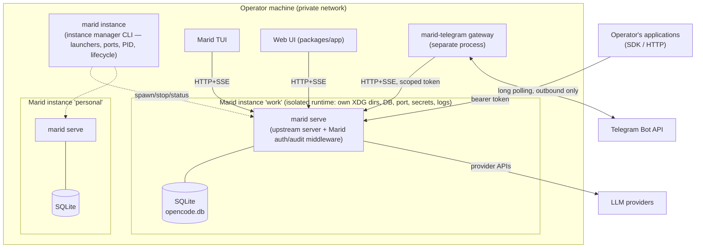

# Marid — Target Architecture (Gate 5)

Marid is a **tracking fork of OpenCode plus a small set of new downstream packages**. The design rule
(DEC-009, approved): reuse upstream capability; anything Marid-specific lives in NEW packages speaking
existing interfaces; direct edits to upstream files are a last resort and every one is enumerated in the
patch-surface register below.

## Principles

1. **One server process per instance.** Every client — TUI, web UI, SDK consumers, channel gateways —
   attaches to that instance's server over the same HTTP+SSE API. This makes cross-interface sync
   (FR-038..043) a property of the existing event bus instead of a new distributed system (C-5).
2. **Additive fork.** Downstream delta = new packages + distribution profile + config defaults.
   Target: ≤ 1 small upstream-file edit (the server extension seam, if no equivalent hook exists).
3. **Untrusted ingress stays outside the core.** Channel gateways are separate processes with their own
   credentials and a capability policy; compromise of a gateway is bounded by its API token (C-7, INV-001).
4. **v1 API now, v2 watched.** Marid builds on the stable v1 surface + published SDK; the v2/sdk-next
   migration is tracked at every upstream sync (C-4, RISK-001).

## Container view



## Components

| Component | Kind | Realizes | Basis / evidence |
|---|---|---|---|
| Runtime core (agent loop, tools, permissions, skills, plugins, MCP, providers, storage) | Upstream, unchanged | FR-001..021 | Gate-4 assessment: reuse as-is |
| Server + SSE (v1 surface) | Upstream, unchanged | FR-022..029, FR-034 partial | R-02: 7 FRs as-is |
| **marid-auth** (new pkg) | Middleware via server extension seam | FR-031 bearer-token auth (per-client tokens with scopes), FR-032 rate limiting, FR-033 audit log, FR-030 request-ID correlation | Shaheen `Server.extend` pattern; single enumerated seam |
| **marid-instance** (new pkg, CLI) | Instance manager | FR-053 (IDs, launchers, port allocation, per-instance XDG/OPENCODE env, PID files, start/stop/status/logs, locks) | claudectl pattern (R-11) + R-05 conflict inventory |
| **marid-telegram** (new pkg, process) | Channel gateway | FR-045..052: long-polling ingress, `update_id` dedup, operator allowlist, HTML formatting, edit-coalesced streaming (≥2 s cadence), permission prompts as inline keyboards, media within Bot-API caps | R-09; slack-prototype loop; Shaheen gateway pattern |
| Channel capability policy | Config (instance-level) + gateway enforcement | FR-052, INV-001: channel maps to a dedicated restricted agent (tool/permission ruleset), scoped API token, model+cost caps at the gateway | R-04 permission rulesets; C-7 |
| TUI / Web UI (packages/app) | Upstream, config-rebranded | FR-003, CON-005 | R-06: app rides the same API |
| Config layer | Upstream + Marid defaults | FR-054/055; instance layer supplied by marid-instance via env (`OPENCODE_CONFIG`, XDG overrides); secret redaction rules | R-05 precedence chain |
| Observability | Upstream OTLP (opt-in) + audit stream from marid-auth | FR-056/057/059; GenAI attrs pinned (R-10) | R-05: OTLP wired |
| Distribution profile | Build/release config | FR-060, CON-004/005: `marid` profile builds core+tui+app+new pkgs; excludes desktop/console/stats/slack/function/enterprise/containers/docs-site/etc. | C-2, C-6 |
| Upstream-sync workflow | Process + CI | FR-061: upstream remote, scheduled merge branch, conflict-detector CI, delta report, security fast-path | C-1, R-10 |

## Patch-surface register (every planned upstream-file edit)

| # | Edit | Why unavoidable | Size | Sync risk |
|---|---|---|---|---|
| ~~P-1~~ | **Not required for MVP** (resolved by EXP-004): marid-auth attaches as an outer wrapper around the exported `Server.Default.app.fetch` (self-contained `toWebHandler`, no `listen()` needed) — no upstream server edit. Revisit only if in-Effect-pipeline request-ID/trace correlation (deep FR-030) is later required. | n/a — wrapper composes the exported handler; auth/rate-limit/audit run at the ingress wrapper | 0 lines (was ~5) | None (no edit) |
| P-2 | Branding surfaces the config cannot reach (TUI title, CLI name/bin, user-agent). **PH-1 (done): CLI identity** — the `marid` binary name + `marid serve`/`marid token` commands + `scriptName("marid")` land via the additive `src/marid.ts` entry (see P-ENTRY), no upstream edit. **PH-5 (deferred): cosmetic** — README, TUI title, user-agent string, logo (operator decision 2026-07-04). | Product identity (§19); config-first, edit only what config can't set | Small, enumerated | Low–medium |
| P-3 | Default config deltas (e.g. `lsp:false`, telemetry defaults) — prefer config files over code edits. (Not yet applied; scheduled with the PH-5 cosmetic pass.) | Distribution defaults | Config only | None |
| P-CI | CI test-timing/env edits for GitHub-hosted runners — enumerated in `upstream-sync-strategy.md` (P-CI-1..4); prefer fixes in `ci.yml` over upstream test edits (P-CI-4 = env-scaled timing, knob in `ci.yml`). Surface as of PH-2: scaled read-sites in `packages/opencode` tests **and** `packages/core/test/util/flock.test.ts`, plus a one-line `turbo.json` `globalPassThroughEnv` entry (knob transport — turbo strict env mode otherwise strips the scale from non-opencode test tasks) | Free 2-core runners are slower/variable vs upstream's runners | Small, per-test + 1 config line | Low (re-apply on conflict) |
| P-ENTRY (additive) | marid binary entry `packages/opencode/src/marid.ts` + profile build `packages/opencode/script/marid-build.ts` — **new files, zero upstream edits**. `src/marid.ts` mirrors `src/index.ts`'s command wiring (branded `marid`, authenticated `serve`, adds `token` + `instance`); `marid-build.ts` mirrors `build.ts`'s defines/worker-paths (swaps entrypoint + binary name). Chosen over a parameterizing edit to `index.ts`/`build.ts` (operator decision 2026-07-04). | `index.ts`/`build.ts` execute on import and aren't reusable builders; additive is more sync-durable than an edit that conflicts | 0 upstream lines (2 new files) | **Drift**: an upstream command added to `index.ts`, or a defines change in `build.ts`, is NOT auto-reflected — reconcile both on each sync (checklist in `upstream-sync-strategy.md`) |

Everything else is additive. The upstream-delta report enumerates P-* plus new packages at every sync. **marid-auth ingress altitude (RESOLVED 2026-07-05, PR #15):** the outer-wrapper seam sees HTTP only, so `client`-scope enforcement was originally per-session *route* ownership. The follow-up landed as option (b): `@marid/auth`'s `event-filter.ts` now body-filters at the wrapper for any non-admin token — dropping non-owned SSE frames from `GET /event` and non-owned entries from `GET /session` / `GET /permission` (all additive, zero upstream edit; invariant pinned by a contract test). Residual: `POST /permission/:requestID/reply` is keyed by an opaque `per_` id the wrapper cannot map to a session — documented in `decisions/open-decision-register.md` as a future in-pipeline follow-up (same seam boundary as deferred FR-030 trace correlation).

## Cross-interface flow (the §7 example, realized)

```mermaid
sequenceDiagram
    participant App as Operator app (SDK)
    participant S as marid serve (instance)
    participant T as TUI
    participant G as Telegram gateway
    App->>S: POST /session (bearer token)
    App->>S: POST prompt (async, client msg-ID)
    S-->>T: SSE: session created/updated (TUI already subscribed)
    Note over T: session appears; operator continues in TUI
    T->>S: prompt via same API
    S-->>App: SSE: message/part deltas (v2 replay via ?after=seq on reconnect)
    S-->>G: SSE: updates → gateway edits Telegram message (2-3 s coalescing)
    G->>S: POST /permission/:id/reply (operator tapped Approve)
```

## Deployment & isolation view

Each instance = one directory tree (config, DB, cache, logs, secrets, port/PID files) + one launcher; the
instance manager composes `XDG_*_HOME`/`OPENCODE_*` env per instance (claudectl pattern) and adds the
pieces claudectl deliberately lacks: port allocation, PID/lock files, graceful shutdown (replacing the
bare `process.exit()` observed in R-05), and status/health checks. Known shared-state hazards from the
R-05 conflict inventory (auth.json RMW, LSP bin cache, global log) are eliminated by directory
namespacing, not by in-place locking of shared files.

## Trust boundaries (summary — full threat model at gate 8)

1. **Telegram ⇄ gateway**: all inbound content untrusted (indirect prompt injection); allowlist + policy.
2. **Gateway ⇄ server**: scoped bearer token; gateway can only what its token allows.
3. **Clients ⇄ server**: private network + per-client tokens; TLS optional on localhost, required beyond it.
4. **Server ⇄ tools/plugins/MCP**: least-privilege rulesets; in-process plugins remain the weakest
   boundary (R-04) — mitigations at gate 8.
5. **Fork ⇄ upstream**: upstream code reviewed at sync; instructions in upstream content never executed (INV-004).

## Open points → experiments (Stage 13) — all executed, see `../research/experiments/`

- EXP-001 ✅ **PASS**: two-client concurrency — upstream single-writer/queue/steer path is safe; marid needs no busy-lock/queue layer (C-5 A holds).
- EXP-002 ✅ **PASS** (audit-strength; live tree-diff deferred): env composition isolates all R-05 items; env set = XDG + `OPENCODE_DB` + allocated port + `TMPDIR/TMP/TEMP`.
- EXP-003 ✅ **PASS** (live): 2.5 s edit cadence, 68 edits, 0×429; permission round-trip 222 ms — R-09 numbers hold.
- EXP-004 ✅ **PASS** (analysis-strength; live build deferred): keep-list is dependency-closed; **P-1 resolved as not required** (outer-wrapper seam).
